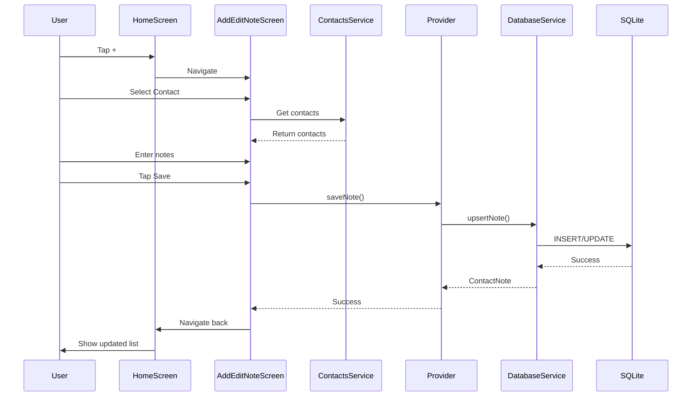
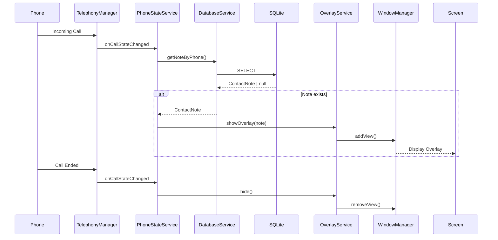

# Архитектура приложения Context Keeper

## 🏗️ Общая структура

Приложение построено по принципам **Clean Architecture** с разделением на слои:

```
┌─────────────────────────────────────────────┐
│           Presentation Layer                │
│   (Screens, Widgets, State Management)      │
├─────────────────────────────────────────────┤
│           Business Logic Layer              │
│        (Providers, Services)                │
├─────────────────────────────────────────────┤
│              Data Layer                     │
│    (Models, Database, Platform Channels)    │
└─────────────────────────────────────────────┘
```

---

## 📱 Платформо-специфичная архитектура

### Android (Полный функционал)

```
Flutter App
    ↓
PhoneService (Dart) ← → MainActivity (Kotlin)
    ↓                         ↓
    ↓                   PhoneStateService
    ↓                   (Background Service)
    ↓                         ↓
    ↓                   TelephonyManager
    ↓                   (System API)
    ↓                         ↓
DatabaseService          [Входящий звонок]
    ↓                         ↓
SQLite DB              OverlayService
                            ↓
                       WindowManager
                       (Show Overlay)
```

**Процесс работы:**

1. `PhoneStateService` работает как foreground service
2. `TelephonyManager` слушает изменения состояния звонка
3. При входящем звонке получаем номер телефона
4. Запрашиваем заметку из `DatabaseService`
5. Если заметка есть → запускаем `OverlayService`
6. `OverlayService` показывает overlay поверх экрана звонка
7. При завершении звонка overlay автоматически скрывается

### iOS (Push-уведомления)

```
Backend Server
    ↓
Phone Provider Webhook
    ↓
[Incoming Call Detected]
    ↓
FCM (Firebase Cloud Messaging)
    ↓
APNs (Apple Push Notification Service)
    ↓
iOS Device
    ↓
NotificationService (Dart)
    ↓
flutter_local_notifications
    ↓
[Показ уведомления]
```

**Процесс работы:**

1. Backend сервер получает webhook о входящем звонке
2. Backend запрашивает заметку из БД пользователя
3. Если заметка есть → отправляет FCM push-уведомление
4. FCM → APNs → iOS устройство
5. iOS показывает уведомление с информацией о контакте

---

## 🔄 Поток данных

### Создание заметки

```
User Input
    ↓
AddEditNoteScreen
    ↓
ContactNotesProvider.saveNote()
    ↓
DatabaseService.upsertNote()
    ↓
SQLite INSERT/UPDATE
    ↓
ContactNotesProvider.notifyListeners()
    ↓
UI Update (HomeScreen)
```

### Входящий звонок (Android)

```
Phone Rings
    ↓
TelephonyManager detects
    ↓
PhoneStateService.onCallStateChanged()
    ↓
Get phone number
    ↓
DatabaseService.getNoteByPhoneNumber()
    ↓
If note exists
    ↓
OverlayService.show()
    ↓
Overlay visible over call screen
    ↓
Call ends
    ↓
OverlayService.hide()
```

---

## 📦 Компоненты системы

### 1. Data Layer

#### Models
- **ContactNote**: Модель данных заметки о контакте
  - Содержит: id, contactId, contactName, phoneNumber, notes, timestamps
  - Методы: toMap(), fromMap(), copyWith()

#### Database
- **DatabaseService**: Singleton для работы с SQLite
  - CRUD операции для заметок
  - Поиск по номеру телефона (с нормализацией)
  - Полнотекстовый поиск
  - Индексы для быстрого поиска

### 2. Business Logic Layer

#### Providers
- **ContactNotesProvider**: State management через Provider
  - Управление списком заметок
  - Синхронизация с БД
  - Обновление UI

#### Services

**PhoneService** (Кросс-платформенный)
- Инициализация платформо-специфичных сервисов
- Управление разрешениями
- Обработка входящих звонков

**DatabaseService**
- Работа с SQLite
- Миграции схемы
- Кэширование

**NotificationService**
- Локальные уведомления
- Firebase Cloud Messaging (iOS)
- Обработка фоновых сообщений

**IOSCallKitService**
- Method channels для iOS
- Интеграция с CallKit
- Push-уведомления

### 3. Presentation Layer

#### Screens

**HomeScreen**
- Список всех заметок
- Поиск
- Статус разрешений
- Навигация

**AddEditNoteScreen**
- Выбор контакта
- Ввод/редактирование заметки
- Валидация

**NoteDetailScreen**
- Детальная информация о заметке
- Редактирование
- Удаление

**PermissionsScreen**
- Статус всех разрешений
- Запрос разрешений
- Ссылка на настройки

---

## 🔐 Безопасность

### Хранение данных
- Все данные хранятся локально в SQLite
- Нет облачной синхронизации (по умолчанию)
- Доступ только для приложения

### Разрешения
- Минимально необходимые разрешения
- Runtime permissions (Android 6+)
- Явный запрос при необходимости

### Приватность
- Номера телефонов нормализуются перед сохранением
- Нет аналитики и трекинга
- Нет отправки данных на сервер (кроме FCM token для iOS)

---

## 🚀 Производительность

### Оптимизации

1. **Database**
   - Индексы на phone_number для быстрого поиска
   - Ленивая загрузка списка заметок
   - Кэширование в памяти через Provider

2. **UI**
   - ListView.builder для больших списков
   - Debounce для поиска
   - Минимальные rebuilds через Provider

3. **Background Services (Android)**
   - Foreground service для надежной работы
   - Минимальное потребление батареи
   - Автоматический останов при неактивности

---

## 🧪 Тестирование

### Unit Tests
```dart
// Тестирование моделей
test('ContactNote toMap/fromMap', () {});

// Тестирование database service
test('DatabaseService CRUD operations', () {});

// Тестирование провайдеров
test('ContactNotesProvider state management', () {});
```

### Integration Tests
```dart
// Тестирование UI flow
testWidgets('Create note flow', (tester) async {});

// Тестирование permissions
testWidgets('Request permissions', (tester) async {});
```

### Platform Tests

**Android:**
```bash
# Симуляция входящего звонка
adb shell am broadcast -a android.intent.action.PHONE_STATE \
  --es state RINGING --es incoming_number +1234567890
```

**iOS:**
```bash
# Отправка тестового push-уведомления
# Используйте Firebase Console или curl
```

---

## 📊 Диаграммы последовательности

### Создание заметки



### Входящий звонок (Android)



---

## 🔮 Будущие улучшения архитектуры

1. **Repository Pattern**
   - Абстрагирование источника данных
   - Легкое добавление облачной синхронизации

2. **Use Cases**
   - Изолированная бизнес-логика
   - Лучшая тестируемость

3. **Dependency Injection**
   - get_it или riverpod
   - Лучшая модульность

4. **State Management**
   - Переход на Riverpod или Bloc
   - Более предсказуемое управление состоянием

5. **Background Sync**
   - WorkManager для Android
   - Background Fetch для iOS
   - Синхронизация с облаком

---

## 📚 Зависимости

### Core
- `flutter` - UI framework
- `provider` - State management

### Data
- `sqflite` - SQLite database
- `path` & `path_provider` - File system

### Platform Integration
- `contacts_service` - Доступ к контактам
- `permission_handler` - Управление разрешениями
- `phone_state` - Мониторинг звонков (Android)

### UI
- `intl` - Форматирование дат

### Notifications & Firebase
- `firebase_core` - Firebase initialization
- `firebase_messaging` - FCM (iOS)
- `flutter_local_notifications` - Локальные уведомления

### Android Specific
- `flutter_overlay_window` - Overlay functionality

---

**Архитектура спроектирована для:**
- ✅ Масштабируемости
- ✅ Тестируемости
- ✅ Поддерживаемости
- ✅ Производительности
- ✅ Безопасности
